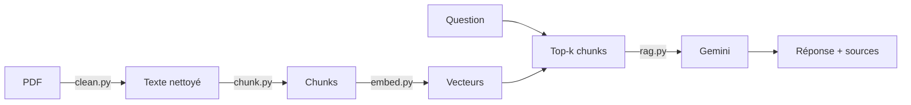

# RAG lab — optimisation des LLM & VLM

Un RAG (*Retrieval-Augmented Generation*) construit de zéro, **sans framework ni base vectorielle**, pour interroger en langage naturel un corpus d'articles de recherche sur l'**optimisation des LLM et VLM** : quantization, pruning, distillation, inférence efficace…

Chaque réponse est rédigée par Gemini **à partir d'extraits des articles**, avec les sources citées (article, section, page).

## Pipeline



| Étape | Script | Ce qu'il fait |
|---|---|---|
| Parsing + nettoyage | `src/clean.py` | PDF → Markdown (pymupdf4llm), retire en-têtes/pieds de page, texte des figures et bibliographie |
| Chunking | `src/chunk.py` | découpe par paragraphes (~1 200 car.), suit les titres de section, chevauchement |
| Embeddings | `src/embed.py` | `gemini-embedding-001` en 768 dim., titre + section ajoutés au chunk, cache reprenable |
| Recherche + génération | `src/rag.py` | similarité cosinus (NumPy) → top-k → `gemini-flash-latest` avec citations |
| Interface | `src/app.py` | chat Streamlit, sources dépliables, réglage du top-k |

Chaque question est tracée dans **Langfuse** (recherche, prompt, réponse, latence).

## Installation

```bash
git clone https://github.com/Vbarbier1809/RAG-OPT.git && cd RAG-OPT
python3 -m venv .venv && source .venv/bin/activate
pip install -r requirements.txt
cp .env.example .env   # puis renseigne tes clés Gemini et Langfuse
```

## Corpus

Les PDF ne sont pas versionnés (droits d'auteur). Pour récupérer le corpus d'origine depuis arXiv :

```bash
for id in 2406.10576v1 2408.03130v1 2411.06084v1 2502.06663v2 2503.12434v2 2507.08836v1 \
          2508.06251v1 2509.08919v1 2601.09865v1 2601.18846v1 2603.13765v1 2603.29010v1 \
          2605.05914v1 2607.20468v1 2607.22583v2 2608.17515v1; do
  curl -sL "https://arxiv.org/pdf/$id" -o "data/raw/$id.pdf"
done
```

Tu peux aussi déposer tes propres PDF dans `data/raw/`.

## Utilisation

```bash
# Construire l'index (une fois, ou après ajout de documents)
python src/clean.py && python src/chunk.py && python src/embed.py

# Interroger
streamlit run src/app.py                          # interface web → http://localhost:8501
python src/rag.py "Quelle différence entre PTQ et QAT ?"   # terminal
```

## Stack

Python · PyMuPDF4LLM · Google Gemini (embeddings + génération) · NumPy · Streamlit · Langfuse

## Documentation

Le fonctionnement détaillé est dans le [guide technique](docs/GUIDE.md) : choix d'implémentation à chaque étape, paramètres, limites, pistes d'amélioration (recherche hybride, reranking…) et évaluation.
