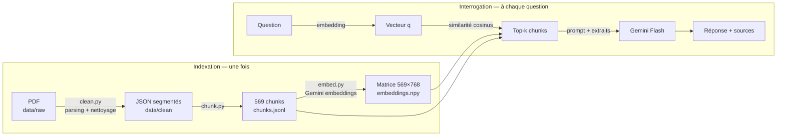

# RAG lab

Un système de **RAG** (*Retrieval-Augmented Generation*) construit de zéro, sans framework (ni LangChain, ni LlamaIndex, ni base vectorielle) : on pose une question en langage naturel sur un corpus de 16 articles scientifiques (arXiv, thème : optimisation des LLM — quantization, pruning, distillation, inférence…) et on obtient une réponse rédigée par Gemini, **appuyée sur des extraits précis des articles et citant ses sources**.

Le but du projet est pédagogique : chaque étape du pipeline tient dans un fichier court et lisible, pour comprendre *ce qui se passe réellement* dans un RAG — et où se cachent ses difficultés.

---

## Sommaire

1. [Démarrage rapide](#1-démarrage-rapide)
2. [Structure du projet](#2-structure-du-projet)
3. [Le RAG : pourquoi et comment](#3-le-rag--pourquoi-et-comment)
4. [Vue d'ensemble du pipeline](#4-vue-densemble-du-pipeline)
5. [Étape 1 — Parsing des PDF](#5-étape-1--parsing-des-pdf)
6. [Étape 2 — Nettoyage](#6-étape-2--nettoyage-srccleanpy)
7. [Étape 3 — Chunking](#7-étape-3--chunking-srcchunkpy)
8. [Étape 4 — Embeddings](#8-étape-4--embeddings-srcembedpy)
9. [Étape 5 — Retrieval](#9-étape-5--retrieval-srcragpy)
10. [Étape 6 — Génération](#10-étape-6--génération-srcragpy)
11. [Observabilité avec Langfuse](#11-observabilité-avec-langfuse)
12. [Interface web](#12-interface-web-srcapppy)
13. [Tous les paramètres réglables](#13-tous-les-paramètres-réglables)
14. [Limites connues](#14-limites-connues)
15. [Pistes d'amélioration](#15-pistes-damélioration)
16. [Évaluer un RAG](#16-évaluer-un-rag-dossier-eval)
17. [Ajouter des documents](#17-ajouter-des-documents)
18. [Dépannage](#18-dépannage)
19. [Glossaire](#19-glossaire)

---

## 1. Démarrage rapide

### Prérequis

- Python 3.11+
- Une clé API **Google Gemini** ([Google AI Studio](https://aistudio.google.com/apikey))
- Un compte **Langfuse** (cloud ou auto-hébergé) pour le traçage

### Installation

```bash
cd rag-lab
python3 -m venv .venv
source .venv/bin/activate
pip install -r requirements.txt
```

Crée un fichier `.env` à la racine de `rag-lab/` :

```env
GOOGLE_API_KEY=...
LANGFUSE_PUBLIC_KEY=pk-lf-...
LANGFUSE_SECRET_KEY=sk-lf-...
LANGFUSE_BASE_URL=https://cloud.langfuse.com
```

> ⚠️ Ne commite jamais `.env` : il contient tes clés.

### Construire l'index (une seule fois)

```bash
python src/clean.py    # PDF (data/raw)  →  JSON nettoyés (data/clean)
python src/chunk.py    # JSON            →  data/processed/chunks.jsonl
python src/embed.py    # chunks          →  data/processed/embeddings.npy
```

`clean.py` et `chunk.py` tournent en local et sont gratuits. `embed.py` appelle l'API Gemini (~12 requêtes, ~200 k tokens).

### Poser des questions

```bash
# Interface web (http://localhost:8501)
streamlit run src/app.py

# Ou en terminal, une question
python src/rag.py "Quelle différence entre PTQ et QAT ?"

# Ou en terminal, mode interactif (Entrée vide pour quitter)
python src/rag.py
```

---

## 2. Structure du projet

```
rag-lab/
├── .env                      # clés API (non versionné)
├── .env.example              # modèle de .env, sans les clés
├── README.md                 # présentation courte
├── docs/GUIDE.md             # ce guide
├── requirements.txt
├── data/
│   ├── raw/                  # PDF d'origine (16 articles arXiv)
│   ├── clean/                # 1 JSON par article : texte nettoyé, découpé en segments
│   └── processed/
│       ├── chunks.jsonl      # 569 chunks + métadonnées (1 par ligne)
│       ├── embeddings.npy    # matrice 569 × 768 (float32, normalisée)
│       └── embed_cache.npz   # cache des vecteurs déjà calculés
├── eval/                     # (à venir) jeu de questions + scripts d'évaluation
└── src/
    ├── clean.py              # étapes 1-2 : parsing PDF + nettoyage
    ├── chunk.py              # étape 3 : découpage en chunks
    ├── embed.py              # étape 4 : vectorisation
    ├── rag.py                # étapes 5-6 : recherche + génération (+ CLI)
    ├── app.py                # interface web Streamlit
    ├── ingest.py             # exploration : compare 2 méthodes de parsing
    └── inspect_parsing.py    # exploration : diagnostique la qualité du parsing
```

Chaque script lit la sortie du précédent sur disque. On peut donc relancer une étape isolément sans refaire tout le pipeline.

---

## 3. Le RAG : pourquoi et comment

### Le problème

Un LLM seul a trois défauts quand on l'interroge sur des documents précis :

| Problème | Explication |
|---|---|
| **Connaissances figées** | Il ne connaît que ce qui était dans ses données d'entraînement, jusqu'à sa date de coupure. Un article publié après, ou un document interne, lui est inconnu. |
| **Hallucinations** | Faute d'information, il produit une réponse *plausible* plutôt que de dire « je ne sais pas ». |
| **Pas de traçabilité** | Impossible de vérifier d'où vient une affirmation. |

On pourrait coller tous les documents dans le prompt, mais : 16 articles ≈ 1,1 million de caractères ≈ 280 k tokens. C'est cher à chaque question, lent, et la qualité baisse quand l'information pertinente est noyée dans un long contexte (phénomène *lost in the middle*). Et cela ne passe pas à l'échelle à 1 000 documents.

### La solution

Le RAG sépare le problème en deux :

1. **Retrieval** (recherche) : trouver, parmi tout le corpus, les **quelques passages** les plus pertinents pour la question.
2. **Generation** : donner au LLM *uniquement ces passages* + la question, en lui demandant de répondre **à partir d'eux** et de citer ses sources.

Le LLM passe du rôle de « mémoire » à celui de « lecteur qui synthétise ». La qualité finale dépend alors surtout de la qualité de la recherche : **si le bon passage n'est pas retrouvé, le meilleur LLM du monde ne peut pas bien répondre.** C'est pourquoi l'essentiel de la complexité d'un RAG se trouve *avant* l'appel au LLM.

### Comment chercher « par le sens » ?

Une recherche par mots-clés échoue dès que la question et le document n'utilisent pas les mêmes mots (« réduire la taille d'un modèle » vs « compression », « INT4 » vs « 4-bit »). On utilise donc des **embeddings** : un modèle transforme chaque texte en un vecteur de nombres (ici 768), de sorte que **deux textes de sens proche donnent des vecteurs proches**. Chercher les passages pertinents revient alors à chercher les vecteurs les plus proches de celui de la question — une simple opération géométrique.

---

## 4. Vue d'ensemble du pipeline

Le pipeline a deux phases : l'**indexation**, faite une fois (hors ligne), et l'**interrogation**, faite à chaque question.



| Étape | Script | Entrée | Sortie | Coût |
|---|---|---|---|---|
| Parsing + nettoyage | `clean.py` | `data/raw/*.pdf` | `data/clean/*.json` | local, ~1 min |
| Chunking | `chunk.py` | `data/clean/*.json` | `chunks.jsonl` | local, < 1 s |
| Embeddings | `embed.py` | `chunks.jsonl` | `embeddings.npy` | API, ~12 appels |
| Retrieval | `rag.py` | question | top-k chunks | 1 appel embedding |
| Génération | `rag.py` | question + chunks | réponse | 1 appel LLM |

---

## 5. Étape 1 — Parsing des PDF

**Le problème :** un PDF n'est pas un document texte. C'est une liste d'instructions de dessin : « écrire tel glyphe à telle position ». Il n'y a ni notion de paragraphe, ni de titre, ni d'ordre de lecture. Les articles scientifiques cumulent les difficultés : deux colonnes, en-têtes et pieds de page répétés, formules, tableaux, figures, notes de bas de page, bibliographie.

Un parsing de mauvaise qualité **empoisonne tout le reste du pipeline** : des phrases coupées en deux ou mélangées entre colonnes produisent de mauvais embeddings, que rien en aval ne pourra rattraper (*garbage in, garbage out*).

### Deux approches comparées (`ingest.py`)

Le script d'exploration `ingest.py` compare deux méthodes de la bibliothèque PyMuPDF :

| Méthode | Principe | Avantages | Inconvénients |
|---|---|---|---|
| `page.get_text()` | texte brut, bloc par bloc | très rapide | aucune structure, colonnes parfois mélangées, mots coupés (`opti-\nmization`) |
| `pymupdf4llm.to_markdown()` | analyse la mise en page, reconstruit du Markdown | titres (`#`), gras, listes, **tableaux en Markdown**, ordre de lecture | plus lent |

`inspect_parsing.py` mesure ensuite, pour chaque fichier : les mots coupés en fin de ligne, les ligatures mal décodées (`fi`, `fl`), les lignes répétées (signe d'en-têtes/pieds de page), et la part du document occupée par la bibliographie.

**Choix retenu : le Markdown de `pymupdf4llm`**, car la structure (titres de sections notamment) est ensuite exploitée par le chunking.

> Ces deux scripts écrivaient dans `data/processed/`. Pour les réutiliser, relance `ingest.py` avant `inspect_parsing.py` (ce dernier plante s'il rencontre les fichiers binaires `.npy`/`.npz`).

---

## 6. Étape 2 — Nettoyage (`src/clean.py`)

`clean.py` parse chaque PDF **page par page** (`page_chunks=True`) et applique trois traitements.

### a) Suppression du texte extrait des images

`pymupdf4llm` tente d'extraire le texte contenu dans les figures (légendes d'axes, labels…) et l'encadre par des balises `<!-- Start of picture text -->`. Ce texte est souvent fragmentaire (« 0.2 0.4 0.6 Accuracy ») et ne sert qu'à bruiter les embeddings : il est supprimé.

### b) Suppression du *boilerplate* (en-têtes et pieds de page)

Les en-têtes (« Preprint. Under review. », nom de la conférence…) se répètent sur chaque page. Règle heuristique :

> Une ligne présente sur **au moins 30 % des pages** (et au moins 3) est considérée comme parasite et retirée partout.

On retire aussi les lignes ne contenant qu'un numéro (1 à 3 chiffres) : les numéros de page. La ligne ` ``` ` (délimiteur de bloc de code) est exclue de la règle, car elle se répète légitimement.

### c) Découpage en sections : `body` / `references` / `appendix`

Des expressions régulières repèrent les titres « References » et « Appendix / Appendices / Supplementary ». Chaque page est découpée en **segments** étiquetés par leur section ; l'étiquette se propage de page en page jusqu'au marqueur suivant.

Pourquoi c'est important : dans ce corpus, **la bibliographie représente ~28 % du texte** (319 k caractères sur 1,13 M). Des chunks composés de « [12] Smith, J. et al. Quantization of… 2023 » sont *très proches* sémantiquement des questions sur la quantization… et totalement inutiles pour y répondre. Les garder polluerait les résultats de recherche.

| Section | Caractères | Part |
|---|---|---|
| body | 792 k | 70 % |
| references | 319 k | 28 % |
| appendix | 15 k | 1 % |

### Format de sortie

```json
{
  "doc_id": "2406.10576v1",
  "segments": [
    {"page": 1, "section": "body", "text": "# **Optimization-based Structural Pruning…"},
    …
  ]
}
```

On conserve le **numéro de page** : il sera propagé jusqu'aux citations de la réponse finale.

---

## 7. Étape 3 — Chunking (`src/chunk.py`)

### Pourquoi découper ?

On ne peut pas créer un embedding par article entier :
- le modèle d'embedding a une limite d'entrée (2 048 tokens pour `gemini-embedding-001`) ;
- surtout, **un vecteur unique pour 20 pages en « moyenne » le sens** : il représente vaguement « un article sur le pruning », mais ne permet pas de retrouver le paragraphe précis qui répond à « quel est le taux de compression obtenu sur LLaMA-7B ? ».

On découpe donc chaque article en **chunks** (morceaux) d'environ un ou deux paragraphes.

### Le dilemme de la taille

| Chunks trop petits | Chunks trop grands |
|---|---|
| ✅ embedding précis | ✅ contexte complet |
| ❌ perdent leur contexte (« Cette méthode réduit la perte de 2 % » : quelle méthode ?) | ❌ embedding dilué, plusieurs idées mélangées |
| ❌ il en faut beaucoup dans le prompt | ❌ moins de chunks tiennent dans le prompt, plus de bruit |

Il n'y a pas de taille universellement optimale ; elle se règle **empiriquement**, avec une évaluation (voir §16). Ici : cible de **1 200 caractères** (~300 tokens), ce qui donne une **médiane de 1 429 caractères** et 569 chunks.

### L'algorithme

1. **Filtrage** : les segments `references` sont écartés ; `body` et `appendix` sont gardés.
2. **Titre** : le premier titre Markdown du document devient le titre de l'article (utilisé pour le contexte et l'affichage).
3. **Découpage en paragraphes** sur les lignes vides. Un paragraphe de plus de **2 000 caractères** (souvent un grand tableau ou un bloc mal parsé) est redécoupé **par phrases**, en regroupant les phrases jusqu'à ~1 200 caractères.
4. **Regroupement** : on accumule des paragraphes entiers dans un tampon ; dès qu'il atteint **1 200 caractères**, on émet un chunk. On ne coupe donc **jamais au milieu d'un paragraphe** (contrairement à un découpage naïf tous les N caractères, qui coupe des phrases en deux).
5. **Suivi de section** : chaque fois qu'un paragraphe commence par un titre Markdown (`## 3.2 Results`), on mémorise ce titre. Chaque chunk hérite du titre de section de son premier paragraphe.
6. **Chevauchement (*overlap*)** : si le dernier paragraphe du chunk émis fait moins de **400 caractères**, il est recopié au début du chunk suivant. Cela évite qu'une idée à cheval sur deux chunks soit perdue, et qu'un titre de section se retrouve orphelin en fin de chunk.
7. **Filtre final** : les chunks de moins de **100 caractères** sont jetés (fragments sans valeur).

### Métadonnées d'un chunk

```json
{
  "doc_id": "2411.06084v1",
  "title": "Optimizing Large Language Models through Quantization: A Comparative Analysis of PTQ and QAT…",
  "heading": "3 Methodology",
  "page": 4,
  "text": "…",
  "id": 87
}
```

`page` est la page du **premier** paragraphe du chunk (un chunk peut déborder sur la page suivante).

### Les stratégies qui existent

| Stratégie | Principe | Ici |
|---|---|---|
| Taille fixe | tous les N caractères/tokens | ❌ coupe les phrases |
| Récursive | paragraphes → phrases → mots jusqu'à tenir dans la limite | ✅ proche de ce qui est fait |
| Par structure | suit les titres Markdown/HTML | ✅ partiellement (suivi des titres) |
| Sémantique | coupe là où la similarité entre phrases consécutives chute | ❌ |
| *Late chunking*, *parent-child* | embeddings de petits morceaux, mais renvoi du bloc parent au LLM | ❌ (piste §15) |

---

## 8. Étape 4 — Embeddings (`src/embed.py`)

### Ce qu'est un embedding

Un modèle d'embedding (ici `gemini-embedding-001`) transforme un texte en un vecteur de dimension fixe. Il a été entraîné (apprentissage contrastif) pour que des textes de sens proche aient des vecteurs pointant dans des directions proches, **indépendamment des mots exacts**, et même d'une langue à l'autre : une question en français retrouve des passages en anglais.

### Mesurer la proximité : la similarité cosinus

$$\cos(\vec a, \vec b) = \frac{\vec a \cdot \vec b}{\|\vec a\|\,\|\vec b\|}$$

Elle vaut 1 pour deux vecteurs de même direction, et diminue quand ils s'écartent. **Si les vecteurs sont normalisés (longueur 1), le cosinus se réduit à un simple produit scalaire** : c'est pour cela que tous les vecteurs sont normalisés, ce qui rend la recherche triviale à calculer (§9).

> En pratique avec ce modèle, les scores ne descendent presque jamais vers 0 : des textes sans rapport tournent autour de 0,6-0,7, des textes pertinents au-dessus de 0,75-0,8. **Seul l'ordre compte**, pas la valeur absolue. Cf. la matrice de l'ancien `hello.py` : la phrase sur la tarte Tatin avait encore 0,70 de similarité avec une phrase sur la quantization.

### Choix techniques

**1. Préfixe de contexte.** On n'envoie pas le chunk nu, mais :

```
<titre de l'article> — <titre de section>

<texte du chunk>
```

Un chunk isolé est souvent ambigu (« Table 3 shows our method outperforms… » : quelle méthode, sur quoi ?). Le titre ancre le chunk dans son document. C'est une version simple du *contextual retrieval* (Anthropic, 2024), qui génère ce contexte avec un LLM.

**2. Types de tâche asymétriques.** Une question (« comment réduire la mémoire ? ») et un passage qui y répond (« Quantizing weights to INT4 reduces the footprint by 4× ») ne se ressemblent pas du tout dans la forme. Gemini propose des `task_type` qui optimisent les vecteurs pour ce cas :

| Côté | `task_type` |
|---|---|
| Chunks (indexation) | `RETRIEVAL_DOCUMENT` |
| Question (recherche) | `RETRIEVAL_QUERY` |

Les deux espaces sont conçus pour être comparés entre eux. **Il est indispensable d'utiliser le même modèle et la même dimension des deux côtés**, sinon les vecteurs ne sont pas comparables.

**3. Dimension réduite : 3 072 → 768 (Matryoshka).** `gemini-embedding-001` produit nativement des vecteurs de 3 072 dimensions, mais il est entraîné par *Matryoshka Representation Learning* : l'information la plus importante est concentrée dans les premières dimensions, on peut donc **tronquer** le vecteur (`output_dimensionality=768`) en perdant peu de qualité, pour 4× moins de mémoire et de calcul. Conséquence : un vecteur tronqué n'est plus de norme 1, d'où la **renormalisation obligatoire** après coup.

**4. Traitement par lots.** Les chunks sont envoyés par **paquets de 50** : 569 chunks = 12 requêtes au lieu de 569.

**5. Gestion des quotas.** En cas de réponse `429` (quota dépassé) ou `503` (serveur surchargé), le client réessaie automatiquement jusqu'à **8 fois**, avec un délai initial de 5 s qui double à chaque tentative (*backoff exponentiel*).

**6. Cache reprenable.** Chaque texte reçoit une empreinte `sha1(modèle | dimension | texte)`. Les vecteurs calculés sont stockés dans `embed_cache.npz`, **sauvegardé après chaque lot**. Conséquences :
- si le script est interrompu (quota, réseau), le relancer reprend là où il s'était arrêté ;
- si on modifie le chunking, seuls les chunks dont le texte a changé sont recalculés ;
- changer de modèle ou de dimension invalide automatiquement le cache (la clé change).

### Sortie

`embeddings.npy` : matrice `float32` de **569 × 768**, normalisée ligne par ligne. **La ligne *i* correspond au chunk d'`id` *i*** de `chunks.jsonl` — c'est cet alignement qui relie un vecteur à son texte.

---

## 9. Étape 5 — Retrieval (`src/rag.py`)

À chaque question :

1. la question est vectorisée (`RETRIEVAL_QUERY`, 768 dimensions) puis normalisée → vecteur **q** ;
2. on calcule **d'un seul coup** la similarité avec les 569 chunks : `scores = V @ q` (produit matrice-vecteur) ;
3. on trie et on garde les **k** meilleurs (`TOP_K = 5` par défaut).

### Recherche exacte vs approchée

Ici la recherche est **exhaustive (*brute force*)** : on compare la question à *tous* les chunks. Coût : 569 × 768 ≈ 440 000 multiplications, soit une fraction de milliseconde avec NumPy. **Aucune base vectorielle n'est nécessaire à cette échelle.**

Cela change avec la taille du corpus :

| Nombre de chunks | Solution adaptée |
|---|---|
| < ~100 k | NumPy brute force (comme ici) |
| 100 k – quelques millions | index approché en mémoire : FAISS, hnswlib |
| Au-delà, ou besoin de filtres / mises à jour / persistance | base vectorielle : Qdrant, pgvector, Weaviate, Chroma… |

Les index approchés (*ANN*, *Approximate Nearest Neighbors*, ex. HNSW : un graphe navigable des vecteurs) évitent de tout comparer, au prix d'une petite probabilité de rater un vrai plus proche voisin.

### Le choix de k

- **k trop petit** : risque de rater l'information (surtout si elle est répartie sur plusieurs chunks ou articles).
- **k trop grand** : plus de bruit dans le prompt, plus de tokens (coût, latence), et le LLM peut être distrait par des passages hors sujet.

L'interface permet de régler k de 1 à 15 pour observer l'effet.

---

## 10. Étape 6 — Génération (`src/rag.py`)

### Le prompt

Les k chunks sont numérotés et injectés dans un prompt avec leur provenance :

```
[1] (Titre de l'article — Section, p. 4)
<texte du chunk>

[2] (…)
```

suivis de consignes :

- **répondre uniquement à partir des extraits** (*grounding*) : limite les hallucinations et l'usage des connaissances internes du modèle ;
- **citer les sources par leur numéro** `[1]`, `[3]` : rend chaque affirmation vérifiable, l'interface affiche les extraits correspondants ;
- **dire clairement si les extraits ne suffisent pas** : on préfère un « je ne sais pas » à une invention ;
- **répondre dans la langue de la question** : le corpus est en anglais, les questions peuvent être en français.

### Le modèle

`gemini-flash-latest` : un modèle rapide et peu coûteux, largement suffisant pour une tâche de synthèse à partir d'extraits fournis. Dans un RAG, **le plus gros du travail « intelligent » est fait par la recherche** ; un modèle plus puissant améliore la rédaction et le raisonnement multi-sources, mais ne compense pas une mauvaise recherche.

> Les consignes réduisent les hallucinations mais ne les éliminent pas : le modèle peut encore mal interpréter un extrait ou attribuer une affirmation à la mauvaise source. Vérifie les citations importantes dans le panneau Sources.

---

## 11. Observabilité avec Langfuse

Un RAG est un système à plusieurs étages : quand une réponse est mauvaise, il faut savoir **quel étage** a échoué. Chaque question produit une **trace** dans Langfuse :

```
rag                       ← la question et la réponse finale
├── retrieve              ← la question et les k chunks retrouvés (avec scores)
│   └── appel embedding
└── appel Gemini          ← le prompt complet envoyé, la réponse, les tokens, la latence
```

- Le décorateur `@observe` de Langfuse crée les étapes `rag` et `retrieve`.
- `GoogleGenAIInstrumentor` (OpenInference / OpenTelemetry) trace automatiquement les appels au SDK Gemini.
- `langfuse.flush()` force l'envoi des traces : sans lui, un script court peut se terminer avant qu'elles ne partent.

**Diagnostic type :**

| Constat dans la trace | Étage fautif | Piste |
|---|---|---|
| Les bons chunks ne sont pas dans `retrieve` | Recherche | chunking, embeddings, k, recherche hybride |
| Les bons chunks sont là, mais la réponse est fausse ou incomplète | Génération | prompt, modèle, ordre des chunks |
| Les chunks retrouvés contiennent du texte illisible | Parsing / nettoyage | `clean.py` |

---

## 12. Interface web (`src/app.py`)

Une application **Streamlit** : `streamlit run src/app.py` → http://localhost:8501.

- **Chat** : historique des questions/réponses de la session.
- **Sources** (sous chaque réponse, dépliable) : pour chaque chunk utilisé, son score de similarité, le titre de l'article, la section, la page, un lien vers l'article sur arXiv, et le texte de l'extrait.
- **Barre latérale** : curseur top-k (1-15), taille de l'index, modèles utilisés, bouton pour effacer la conversation.
- Si l'index n'existe pas encore, l'application affiche les commandes à lancer au lieu de planter.

`app.py` importe `rag.py` et appelle `rag.ask(question, k)` : la logique RAG n'existe qu'à un seul endroit. Le bloc `if __name__ == "__main__":` de `rag.py` garantit que le mode terminal ne se déclenche pas lors de cet import.

> Streamlit ré-exécute tout le script à chaque interaction ; l'historique est conservé dans `st.session_state`, et l'index n'est chargé qu'une fois grâce au cache des modules Python.

---

## 13. Tous les paramètres réglables

| Paramètre | Fichier | Valeur | Effet |
|---|---|---|---|
| Seuil boilerplate | `clean.py` | 30 % des pages (min. 3) | plus bas = nettoie plus, risque de supprimer du vrai contenu |
| `TARGET` | `chunk.py` | 1 200 car. | taille visée des chunks |
| `MAX_PARA` | `chunk.py` | 2 000 car. | au-delà, un paragraphe est redécoupé par phrases |
| `OVERLAP` | `chunk.py` | 400 car. | taille max du paragraphe recopié d'un chunk au suivant |
| `MIN_CHUNK` | `chunk.py` | 100 car. | chunks plus petits jetés |
| `MODEL` / `EMBED_MODEL` | `embed.py` / `rag.py` | `gemini-embedding-001` | **doit être identique** dans les deux fichiers |
| `DIM` | `embed.py` / `rag.py` | 768 | 768, 1 536 ou 3 072 ; **identique** dans les deux fichiers |
| `BATCH` | `embed.py` | 50 | chunks par requête d'embedding |
| `TOP_K` | `rag.py` (+ curseur UI) | 5 | nombre de chunks donnés au LLM |
| `GEN_MODEL` | `rag.py` | `gemini-flash-latest` | modèle de génération |
| `PROMPT` | `rag.py` | — | consignes données au LLM |

**Après modification**, relance les étapes concernées :

| Tu modifies… | Relance |
|---|---|
| `clean.py` | `clean.py` → `chunk.py` → `embed.py` |
| `chunk.py` | `chunk.py` → `embed.py` (le cache évite de recalculer les chunks inchangés) |
| `DIM` ou le modèle d'embedding | `embed.py` (tout est recalculé), et aligne `rag.py` |
| `TOP_K`, `GEN_MODEL`, `PROMPT` | rien, effet immédiat |

---

## 14. Limites connues

Ce RAG est volontairement simple. Ses limites actuelles :

1. **Pas de mémoire conversationnelle.** Chaque question est traitée indépendamment, même dans l'interface. « Et pour le pruning ? » après une question sur la quantization ne sera pas compris : il faut reformuler une question complète.
2. **Recherche purement sémantique.** Les embeddings gèrent mal les correspondances exactes : noms propres, acronymes rares, noms de modèles (« LLaMA-2-7B »), chiffres. Une recherche lexicale (BM25) serait meilleure sur ces cas.
3. **Tableaux, figures et formules.** Les figures sont ignorées, les formules sont souvent mal extraites, et un grand tableau peut être redécoupé par « phrases » de façon incohérente. Or une grande partie des résultats chiffrés des articles est dans les tableaux.
4. **Détection des sections par regex.** Un paragraphe commençant par « References to prior work… » pourrait être pris pour le début de la bibliographie (et tout ce qui suit serait exclu). À l'inverse, une bibliographie sans titre standard ne serait pas détectée.
5. **Questions globales.** « Quels sont les grands thèmes du corpus ? » ou « compare les 16 articles » nécessitent une vue d'ensemble que 5 chunks ne donnent pas. Le RAG classique est fait pour les questions dont la réponse est **localisée**.
6. **Scores non calibrés.** Il n'y a pas de seuil de pertinence : les k meilleurs chunks sont toujours envoyés, même si aucun n'est pertinent (on compte alors sur le LLM pour dire « je ne sais pas »).
7. **Pas de déduplication** : l'overlap peut faire remonter deux chunks voisins qui se répètent partiellement.
8. **Page approximative** : c'est la page du début du chunk.

---

## 15. Pistes d'amélioration

Classées approximativement par rapport gain/effort :

| Technique | Principe | Corrige |
|---|---|---|
| **Évaluation** (§16) | mesurer avant d'optimiser | tout : sans elle, on améliore à l'aveugle |
| **Recherche hybride** | combiner BM25 (mots-clés) et embeddings, fusionner les classements (*Reciprocal Rank Fusion*) | limite 2 |
| **Reranking** | récupérer 30-50 candidats, puis les reclasser avec un *cross-encoder* (qui lit question et chunk ensemble, plus précis mais plus lent) ou un LLM, garder les 5 meilleurs | précision du top-k |
| **Réécriture de la question** | le LLM reformule la question en tenant compte de l'historique | limite 1 |
| **Décomposition / multi-query** | découper une question complexe en sous-questions, chercher pour chacune | questions comparatives |
| **HyDE** | générer une réponse hypothétique et chercher avec *son* embedding (plus proche d'un passage de document que la question) | écart question ↔ document |
| **Parent-child / small-to-big** | indexer de petits chunks (précis) mais envoyer au LLM le bloc parent plus large (contexte) | dilemme de taille §7 |
| **Filtres par métadonnées** | restreindre la recherche à un article, une section, une année | questions ciblées |
| **Seuil de similarité** | ne pas envoyer les chunks sous un score minimal | limite 6 |
| **MMR** (*Maximal Marginal Relevance*) | diversifier les résultats en pénalisant les chunks trop similaires entre eux | limite 7 |
| **Parsing des tableaux** | garder chaque tableau Markdown comme un chunk entier, avec sa légende | limite 3 |
| **Contextual retrieval** | faire générer par un LLM une phrase de contexte pour chaque chunk avant l'embedding | ambiguïté des chunks |
| **Streaming** | afficher la réponse au fur et à mesure | confort |

---

## 16. Évaluer un RAG (dossier `eval/`)

**Principe fondamental : on évalue la recherche et la génération séparément**, pour savoir quoi corriger.

### Le jeu de test

Une liste de questions avec, pour chacune, la réponse attendue et le ou les passages (`doc_id` + page, ou `id` de chunk) qui contiennent la réponse. 30 à 50 questions variées suffisent pour commencer : factuelles, chiffrées, comparatives, et **quelques questions sans réponse dans le corpus** (pour tester le « je ne sais pas »).

Il peut être généré en partie par un LLM (« voici un chunk, écris une question dont il est la réponse »), puis relu à la main.

### Métriques de recherche (sans LLM, rapides, gratuites)

| Métrique | Question posée |
|---|---|
| **Recall@k** / *hit rate* | le bon passage est-il parmi les k chunks retrouvés ? |
| **MRR** (*Mean Reciprocal Rank*) | à quel rang arrive le bon passage ? (1er → 1, 2e → 0,5, 3e → 0,33…) |
| **Precision@k** | quelle part des k chunks est réellement pertinente ? |

Ce sont ces métriques qu'il faut suivre en priorité quand on modifie le chunking, la dimension, k, ou qu'on ajoute la recherche hybride.

### Métriques de génération (souvent via un LLM juge)

| Métrique | Question posée |
|---|---|
| **Fidélité** (*faithfulness*) | chaque affirmation de la réponse est-elle soutenue par les extraits fournis ? (mesure les hallucinations) |
| **Pertinence de la réponse** | la réponse répond-elle à la question posée ? |
| **Exactitude** | la réponse correspond-elle à la réponse attendue ? |
| **Qualité des citations** | les numéros `[n]` pointent-ils vers le bon extrait ? |

Outils possibles : les *datasets* et *scores* de Langfuse (déjà branché), Ragas, ou un simple script avec un LLM juge.

---

## 17. Ajouter des documents

1. Dépose les nouveaux PDF dans `data/raw/`.
2. Relance :
   ```bash
   python src/clean.py
   python src/chunk.py
   python src/embed.py
   ```
   Grâce au cache, `embed.py` ne calcule que les nouveaux chunks.
3. Redémarre l'interface Streamlit (`Ctrl+C` puis `streamlit run src/app.py`) : l'index est chargé au démarrage.

Le pipeline est conçu pour des **PDF** d'articles scientifiques. D'autres types de documents (Markdown, HTML, PDF sans structure de sections) nécessiteront d'adapter `clean.py`.

> Le lien arXiv affiché dans les sources suppose que le nom du fichier est un identifiant arXiv (ex. `2406.10576v1.pdf`).

---

## 18. Dépannage

| Symptôme | Cause probable | Solution |
|---|---|---|
| `ModuleNotFoundError: No module named 'dotenv'` (ou autre) | environnement virtuel non activé | `source .venv/bin/activate` |
| `No such file or directory: …/chunks.jsonl` ou `embeddings.npy` | index pas encore construit | lancer `chunk.py` puis `embed.py` |
| `429 RESOURCE_EXHAUSTED` | quota Gemini dépassé | `embed.py` réessaie tout seul ; sinon attendre et relancer (le cache reprend) |
| Erreur d'authentification Langfuse | clés `LANGFUSE_*` invalides ou mauvaise URL | vérifier `.env` |
| `ValueError: shapes … not aligned` | `DIM` différent entre `embed.py` et `rag.py` | aligner `DIM`, relancer `embed.py` |
| Réponses incohérentes après modification de `chunk.py` | `embeddings.npy` ne correspond plus à `chunks.jsonl` | relancer `embed.py` |
| Message *automatic function calling (AFC)* | avertissement du SDK Google | sans conséquence |
| Le navigateur ne s'ouvre pas | — | ouvrir http://localhost:8501 |

---

## 19. Glossaire

| Terme | Définition |
|---|---|
| **RAG** | *Retrieval-Augmented Generation* : générer une réponse à partir de documents retrouvés par une recherche. |
| **Chunk** | morceau de document (ici ~1-2 paragraphes), unité de base de la recherche. |
| **Embedding** | vecteur numérique représentant le sens d'un texte. |
| **Similarité cosinus** | mesure de proximité entre deux vecteurs (angle entre eux). |
| **Top-k** | les k résultats les mieux classés. |
| **Grounding** | contraindre le LLM à s'appuyer sur les sources fournies. |
| **Hallucination** | affirmation fausse produite avec assurance par un LLM. |
| **Matryoshka (MRL)** | entraînement qui permet de tronquer un embedding en gardant l'essentiel de sa qualité. |
| **ANN / HNSW** | recherche de plus proches voisins approchée / graphe utilisé pour la faire. |
| **BM25** | algorithme classique de recherche par mots-clés, pondéré par la rareté des mots. |
| **Reranking** | second tri, plus précis, des résultats d'une première recherche. |
| **Cross-encoder** | modèle qui lit question et passage ensemble pour noter leur pertinence. |
| **Boilerplate** | texte répétitif sans valeur (en-têtes, pieds de page). |
| **Backoff exponentiel** | stratégie de réessai où le délai double à chaque échec. |
| **Trace** | enregistrement détaillé de toutes les étapes d'une requête (Langfuse). |
